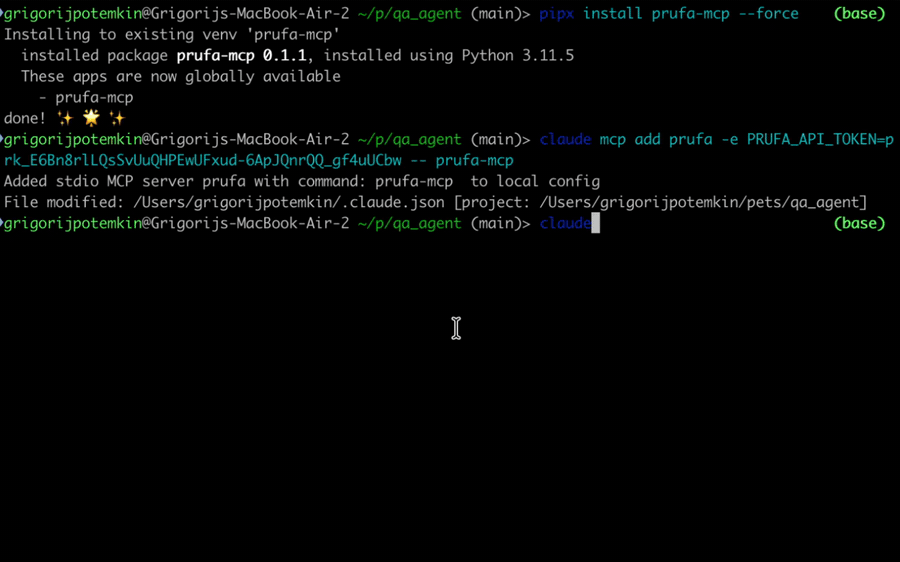

# prufa-mcp — the QA agent for your vibe-coded app

> "Median 5 hours from vulnerability disclosure to mass automated exploitation."
> — [Patchstack 2026 State of WordPress Security](https://www.propellermediaworks.com/blog/web-security-ai-hackers-risk-vibe-coding)

Vibe-coded apps ship faster than humans can review. Prufa is the agent that
audits them — tracking pixels, broken flows, consent violations, console errors —
before the 5-hour window opens.

## 30-second demo



> The demo GIF will land in a future release. Until then, see "What you get" below
> for the live call shape, and `examples/` for runnable scripts.

## Install

The package is on [PyPI](https://pypi.org/project/prufa-mcp/) (v0.1.3). Install it
globally with `pipx` (recommended — installs into an isolated venv and exposes
the `prufa-mcp` binary on your PATH) or into a project venv with `pip`:

```bash
# Recommended — global install, isolated venv
pipx install prufa-mcp

# Or, into your project venv
pip install prufa-mcp

# Verify the binary is on PATH
which prufa-mcp
# Should print something like: /Users/you/.local/bin/prufa-mcp
```

You also need a free Prufa API key. The first audit is free, no card required.

1. Sign in at [prufa.dev](https://prufa.dev) (Google OAuth)
2. Create an API key from the dashboard — or via the CLI: `prufa keys mint "<name>"`

## Wire into your agent

The MCP server runs as a stdio subprocess, spawned by your agent on first use.
The cleanest way to register it is `claude mcp add` (Claude Code's built-in
command — it writes the config to `~/.claude.json` correctly, which the
`~/.claude/mcp.json` path does NOT).

### Claude Code (recommended path)

```bash
# Get the absolute path of the binary (use whatever `which prufa-mcp` returned)
PRUFA_BIN=$(which prufa-mcp)

# Add the MCP server. The token stays out of your shell history.
read -s -p "Prufa API token: " PRUFA_TOKEN && echo
claude mcp add \
  --scope user \
  --env "PRUFA_API_TOKEN=$PRUFA_TOKEN" \
  prufa \
  -- "$PRUFA_BIN"
```

Restart Claude Code (config is read at startup), then verify:

```
/mcp
```

You should see `prufa` listed as **Connected**, with `prufa_run_audit` and
`prufa_get_report` as available tools.

### Cursor / Cline / Continue (hand-edit `.mcp.json`)

In your project root or in `~/.config/Claude/` etc.:

```json
{
  "mcpServers": {
    "prufa": {
      "command": "/Users/you/.local/bin/prufa-mcp",
      "env": {
        "PRUFA_API_TOKEN": "your-prufa-api-key"
      }
    }
  }
}
```

Restart the host app. The command path must be the absolute binary path
(not `~`, not `$()`) — those don't expand in MCP config.

## Use it

In your agent:

```
> audit https://my-vibe-coded-app.com and show me the criticals
> run prufa on my staging deploy
> fetch the report for the audit I just ran
```

`prufa_run_audit` with `wait=true` (the default) **blocks** until the audit
completes and returns the JSON report directly — typically 25–60s for a public
page. If you set `wait=false`, the call returns immediately with the queued
state plus a `share_token` you can poll with `prufa_get_report`.

## What you get (the OSS surface)

| Tool | What it does |
|---|---|
| `prufa_run_audit(url, wait=true)` | Triggers a public-page audit, polls until done, returns findings JSON. The `wait` flag is honored — it actually blocks. |
| `prufa_get_report(report_id)` | Fetches a report. `report_id` is EITHER the run UUID (from `prufa_run_audit`'s `run_id` field) OR the `share_token` (the slug from `/r/<token>` in the audit creation `report_url`). The slug is what you'll see most often — use that. |

The other ~13 tools (workspace setup, flows, monitors, alerts, billing) live in
the hosted product at [prufa.dev](https://prufa.dev).

## Examples

Three runnable scripts in `examples/`:

- `examples/nextjs-app/` — audit a deployed Next.js app
- `examples/vite-spa/` — audit a Vite SPA (focuses on client-side routing audits)
- `examples/stripe-checkout/` — audit a Stripe-checkout page (payment-flow verification)

Each is a copy-pasteable demo:

```bash
export PRUFA_API_TOKEN=...
python examples/nextjs-app/audit.py https://your-nextjs-app.com
```

## GitHub Action

Add PR-time audits to any repo:

```yaml
# .github/workflows/prufa-scan.yml
name: Prufa scan
on: [pull_request]
jobs:
  audit:
    runs-on: ubuntu-latest
    steps:
      - uses: actions/checkout@v4
      - uses: actions/setup-python@v5
        with:
          python-version: "3.11"
      - run: pip install prufa-mcp
      - name: Run audit
        env:
          PRUFA_API_TOKEN: ${{ secrets.PRUFA_API_TOKEN }}
        run: |
          python -c "
          import asyncio, json, sys
          from prufa_mcp.audit import run_audit
          result = asyncio.run(run_audit(url='${{ secrets.STAGING_URL }}', wait=True))
          print(json.dumps(result, indent=2))
          criticals = [f for f in result.get('findings', []) if f.get('severity') == 'critical']
          if criticals:
              print(f'::error::Prufa found {len(criticals)} critical finding(s)', file=sys.stderr)
              sys.exit(1)
          "
```

See `examples/prufa-scan.yml` for the full template.

## SLO

- **Hosted audit API:** 30-second p95 for `wait=true` on public pages.
- **OSS MCP server:** thin client — its only SLO is "responds to MCP `list_tools` and `call_tool` within 1 second" (the heavy work happens server-side).

## Versioning

Published via [Trusted Publishing](https://docs.pypi.org/trusted-publishers/) from
the GitHub Action on every `v*` tag. Install a specific version with
`pipx install prufa-mcp==0.1.3` or `pip install prufa-mcp==0.1.3`.

## License

Apache-2.0. See [LICENSE](LICENSE).
